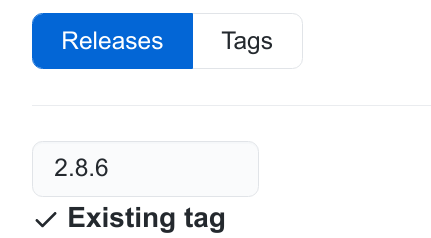
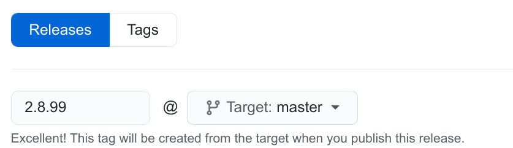
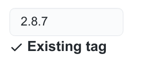
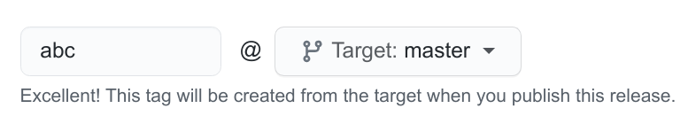

## Branch Specific Configuration for the `release-drafter` action

From https://github.com/release-drafter/release-drafter/issues/656
- Specifically https://github.com/release-drafter/release-drafter/issues/656#issuecomment-806184887

### How to enable branch specific configuration

Here is the quoted copy of https://github.com/release-drafter/release-drafter/issues/656#issuecomment-806184887

> This is possible thanks to the `filter-by-commitish` config introduced in [#657](https://github.com/release-drafter/release-drafter/pull/657) / [#683](https://github.com/release-drafter/release-drafter/pull/683).
> 
> It took me a while to figure out how things work, that's why I am going to share my learnings. Actually, I set up an example repo which I used as a playground to get things working: https://github.com/mkurz/release-drafter-test/ You can fork that repo and just try yourself.
> 
> So let's assume you currently have two branches: a `master` branch (which is your GitHub default branch) and a `2.8.x` branch. The `master` branch is your dirty development branch in which you work towards a 2.9.0 release - so later you will create a `2.9.x` branch off it, like you did with the `2.8.x` branch long time ago. From the `2.8.x` branch you released versions `2.8.1`, `2.8.2`,... Actually `2.8.0` was tagged on the master branch back then, and only afterwards the 2.8.x branch was created, like you would tag the 2.9.0 release from the master branch and afterwards create the 2.9.x branch from it.
> 
> So now let's configure the release drafter: In your GitHub default branch (which is the `master` branch in the above example) you need to create two separate release drafter configs, one for each branch:
> 
> * `.github/release-drafter-master.yml`
>   
>   * You have to configure `filter-by-commitish` and `commitish` and also use `$NEXT_MINOR_VERSION` for the name and tag template, see here: https://github.com/mkurz/release-drafter-test/blob/master/.github/release-drafter-master.yml#L2-L5
> * `.github/release-drafter-2.8.x.yml`
>   
>   * Same again, but different values: https://github.com/mkurz/release-drafter-test/blob/master/.github/release-drafter-2.8.x.yml#L2-L5
> 
> We did setup the release-drafter configs, now we need to configure the GitHub workflows to run release drafter on the right branches with the right configs. In **both** your branches you need to create a `.github/workflows/release-drafter.yml` config:
> 
> * https://github.com/mkurz/release-drafter-test/blob/master/.github/workflows/release-drafter.yml
> * https://github.com/mkurz/release-drafter-test/blob/2.8.x/.github/workflows/release-drafter.yml
> 
> As you can see the `config-name` config within this file refers to the release drafter configs that are _both_ located in the default (=master) branch. Also the workflow is setup to run on `push` events for the branch the file is located in (line 7).
> 
> So that is basically it, the workflows run and draft releases get created... But wait... You configured everything correctly but the drafted releases are incorrect? That's probably because the GitHub releases have the wrong `target_commitish` set. What do I mean? First of all: I am talking about the releases you can see in a GitHub repo, like e.g. https://github.com/mkurz/release-drafter-test/releases - but don't confuse such releases with tags (https://github.com/mkurz/release-drafter-test/tags)! Not every tag is (or has to be) a GitHub release! So what is the `target_commitish`? Usually when you create a release with the GitHub UI (by visiting https://github.com/.../releases/new of your repo) you have two choices.
> 
> * (Choice ONE) Either you enter an existing tag:
>   
>   [link to original_image](https://user-images.githubusercontent.com/644927/112369139-27998b80-8cdc-11eb-959c-8b2c588798e3.png)
> * (Choice TWO) or you create a new tag off an branch:
>   
>   [link to original_image](https://user-images.githubusercontent.com/644927/112369276-4bf56800-8cdc-11eb-9951-e9c26dd9507b.png)
> 
> So, here you can see the "target" branch... That is exactly what the `target_commitish` is. So if you choose `master` here, the `target_commitish` for that 2.8.99 release would be `master`, if you choose the `2.8.x` branch the `target_commitish` for that 2.8.99 release would be `2.8.x`. Alright, that means as long as you did and do cut your releases from the GitHub UI by choosing the target branch, the `target_commitish` would always be correct. However usually that is not the case, usually people create tags on the command line or have some kind of release/publishing/whatever pipeline setup in their (CI/CD or whatever) environment. That means usually you already have existing tags (which later can and often will be mapped to a GitHub release, see "Choice ONE" above). So how can you actually _see_ the `target_commitish` of an existing release or even change it? You can get details about all your releases (again I am talking about GitHub releases not about tags) via the [GitHub API](https://docs.github.com/en/rest/reference/repos#list-releases):
> 
> ```
> curl https://api.github.com/repos/mkurz/release-drafter-test/releases
> ```
> 
> This gives you some nice JSON which should containt a line like
> 
> ```
> "target_commitish": "master",
> ```
> 
> for every release. Now, if a config contains the lines
> 
> ```
> filter-by-commitish: true
> commitish: 2.8.x
> ```
> 
> the release drafter will fetch all the releases, filter only the ones with `target_commitish` set to `2.8.x` and get the last release of this filtered releases. In my case I had a repo where **all** releases (2.0.0 - 2.8.7) had the `target_commitish` set to `master`. That was a problem, because filtering by commitish 2.8.x would not work as there does no commitish 2.8.x exist for a release... To change a `target_commitish` for an existing release you can
> 
> * either use the GitHub API again: https://docs.github.com/en/rest/reference/releases#update-a-release
>   > target_commitish ... Specifies the commitish value that determines where the Git tag is created from. Can be any branch or commit SHA. **Unused if the Git tag already exists**. **Default: the repository's default branch (usually master)**.
> * or use the GitHub UI again: Go to the page where you can edit a release (like https://github.com/.../releases/edit/2.8.7). You will see that the tag (of course) already exists:
>   
>   [link to original_image](https://user-images.githubusercontent.com/644927/112381209-9e3d8580-8cea-11eb-9120-465f40f14513.png)
>   Now clear that textbox, instead write something random like "abc" and, with the cursor, leave the textbox (focus out). The target branch dropdown will now appear:
>   
>   [link to original_image](https://user-images.githubusercontent.com/644927/112381444-de9d0380-8cea-11eb-9bc0-06671a5c0617.png)
>   Now choose the wished target branch (=target_commitish), and then again enter the original tag, so you can see "Existing tag" again and the dropdown disappears, so actually the screen it looks like before. Now you changed the `target_commitish` and you can save the release ("Update release" button).
>   You should do that for all 2.8.1, 2.8.2 releases: Set them the `target_commitish` to 2.8.x. Now the release that gets draft for the 2.8.x branch will use 2.8.2 as the latest release.
>   For major releases like 2.8.0 you should set (or keep) the `target_commitish` to `master`. This way the release that gets drafted for the master branch will use the 2.8.0 release as the latest release.
> 
> That's it, I hope I can help other people with this howto.

